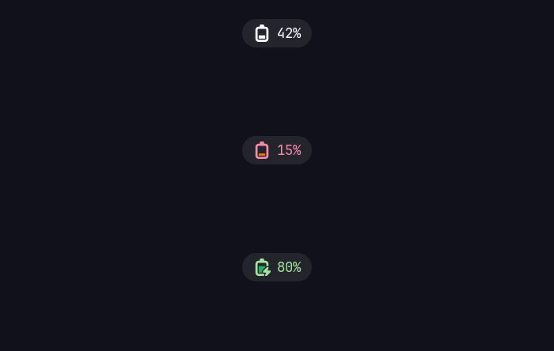

# gtklock-battery-module

gtklock module showing battery status on the lockscreen.



Displays the battery as a pill chip with a level-matching symbolic icon and
percentage. The chip turns red when the battery is low, green while charging
or full, and hides itself entirely on machines without a battery — so the
same config can be shared across laptops and desktops.

Follows the same conventions as the official gtklock modules
([userinfo](https://github.com/jovanlanik/gtklock-userinfo-module),
[powerbar](https://github.com/jovanlanik/gtklock-powerbar-module),
[playerctl](https://github.com/jovanlanik/gtklock-playerctl-module)).

## Features

- Battery icon matches charge level in 10% steps, with charging/charged variants
- State colors: red at or below the low threshold, green while on AC
- Auto-hides when no battery is present (and reappears if one shows up)
- Reads directly from `/sys/class/power_supply` — no dependencies beyond GTK
- Configurable power supply path, refresh interval, and low threshold

## Requirements

- gtklock 4.x (module ABI v4)
- GTK 3 (`libgtk-3-dev` on Debian, `gtk3` on Arch)
- An icon theme shipping `battery-level-*-symbolic` icons (Adwaita does)

## Building

With meson:

```sh
meson setup build
ninja -C build
sudo ninja -C build install
```

Or the quick single-file build:

```sh
./build.sh
```

which produces `battery-module.so` in the repo root.

## Usage

```sh
gtklock -m battery-module.so
```

Or in `~/.config/gtklock/config.ini` (entries are `;`-separated):

```ini
[main]
modules=battery-module.so
```

Use an absolute path if the module isn't installed in gtklock's module
directory (e.g. `/usr/lib/gtklock/`).

## Configuration

All options live in the `[battery]` group of the gtklock config:

```ini
[battery]
battery-path=/sys/class/power_supply/BAT0
battery-refresh=30
battery-low-percent=20
```

| Option                | Default                          | Description                                  |
| --------------------- | -------------------------------- | -------------------------------------------- |
| `battery-path`        | `/sys/class/power_supply/BAT0`   | sysfs directory of the battery to monitor    |
| `battery-refresh`     | `30`                             | refresh interval in seconds                  |
| `battery-low-percent` | `20`                             | at or below this, the chip turns red         |

## Styling

The widget exposes CSS names `#battery-box`, `#battery-icon` and
`#battery-label`, with state classes `.battery-low` and `.battery-charging`.
Note that the module installs its own style slightly above gtklock's user
stylesheet priority so that global rules (like `* { color: ... }`) don't
clobber the state colors.

## License

GPL-3.0-or-later. `gtklock-module.h` is vendored from
[gtklock](https://github.com/jovanlanik/gtklock) (MIT, © Jovan Lanik).
